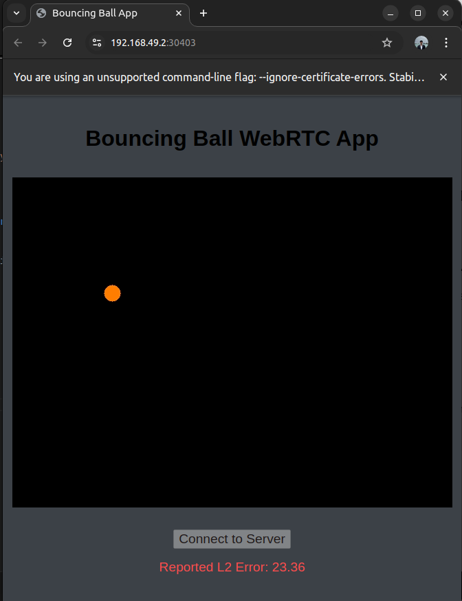
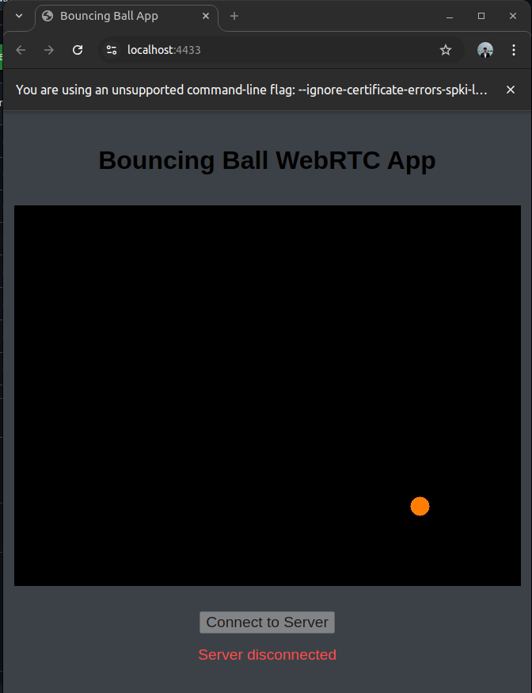

# Nimble Challenge 2025

## Overview

This repository contains an application that uses real-time communication using `webTransport` ([aioquic](https://github.com/aiortc/aioquic)) and real-time video streaming `webRTC` ([aiortc](https://github.com/aiortc/aiortc)).

The application is a simple vanilla JavaScript web app that is served by a Python server, as the challenge necessitates displaying video and data on a browser.

When launched, the web app sends a WebRTC SDP offer to the server over a WebTransport bidirectional stream. Upon receiving the request, the server handles it, spawns a worker thread for video frame generation, and responds with an SDP answer over the same WebTransport stream.

The thread generates frames of a bouncing ball simulation at a configurable FPS. The server also enforces the use of the H.264 codec for video streaming. The server then consumes the generated frames as aiortc `VideoFrames`, encodes them, and streams them over the WebRTC connection.

Upon receiving the frames, the web app/client displays the video, copies the frame over to a hidden canvas element, and gets the pixel data to compute the centroid of the ball using the red channel. This ball center is then sent back to the server over the same WebTransport stream for further processing.

The server receives this detected center, computes the L2 norm to find the difference between the client-reported detected centers and the current center from the latest frame generated. The server then finally streams the error back to the client web app over the WebTransport stream that's open, and the client receives and displays the error on the browser.

The repository also contains unit tests for all the Python functions used in the simulation.


# Get Started

**Note:**  Documentation for Kubernetes deployment usind Minikube can be found [here](./deploy/README.md).

## Prerequisites
**Note:** This application was made and tested on an Ubuntu Machine.

### Web App

- Install [Google Chrome](https://www.google.com/chrome/) (or any other chromium based web browser).

- Install [openssl]

- This project requires using WebTransport. HTTP/3 always operates using TLS, meaning that running a WebTransport over
 HTTP/3 server requires a valid TLS certificate. Chrome/Chromium can be instructed to trust a self-signed
 certificate using command-line flags.  
 Here are step-by-step instructions on how to do that:

   1. Generate a certificate and a private key:
        ```bash
         openssl req -newkey rsa:2048 -nodes -keyout server/certificate.key \
                   -x509 -out server/certificate.pem -subj '/CN=Test Certificate' \
                   -addext "subjectAltName = DNS:localhost"
        ```
   2. Compute the fingerprint of the certificate:
      ```bash
         openssl x509 -pubkey -noout -in server/certificate.pem |
                   openssl rsa -pubin -outform der |
                   openssl dgst -sha256 -binary | base64
        ```
      The result should be a base64-encoded blob that looks like this: `"Gi/HIwdiMcPZo2KBjnstF5kQdLI5bPrYJ8i3Vi6Ybck="`

### Server 
The application's server is available both as a python scripts and docker image.

#### Python
- Setup a virtual environment:

    ```bash
    python3 -m venv .ballsim
    source .objdet/bin/activate
    ```
- Install requirements:

    ```bash
    pip install --no-cache-dir -r requirements.txt
    ```

#### Docker

- Install [Docker](https://docs.docker.com/engine/install/ubuntu/)

- build docker image from the dockerfile: 
    ```bash
    docker build -t nimble-challenge-server .
    ```

##  Run

### Server

#### Python

- For constant velocity (communication latency testing), run:
    ```bash
    python server/http3_server.py -c server/certificate.pem -k server/certificate.key --fps 60 --grav 0 --vel 1000.0 1000.0 --cor 1
    ```
 

- For ball simulation with gravity and inellastic collisions, run:
    ```bash
    python server/http3_server.py -c server/certificate.pem -k server/certificate.key --fps 60 --grav 980 --vel 1000.0 1000.0 --cor 0.98` 
    ```
- You can find more configurable arguments in the arg parser [here](./server/http3_server.py)

#### Docker 

- To run server docker container: 
    ```bash
    docker run --rm -p 4433:4433/udp --name nimble-local-test  nimble-challenge-server
    ```
- To stop container, in a new terminal run: 
    ```bash
    docker stop nimble-local-test
    ```
- To remove the container, stop the container and run:
    ```bash
    docker rm nimble-local-test
    ```
- For changing arguments passes to the server, edit the [dockerfile](./dockerfile) and rebuild the image.

### Web App 

- To launch the web app, run: 
    ```bash
    google-chrome   --enable-experimental-web-platform-features   --ignore-certificate-errors-spki-list=ggR1vjmsgl5RdfYS3f5C2nYyZ3LRrjfOyD/Va/JLcXQ=   --origin-to-force-quic-on=localhost:4433   https://localhost:4433/
    ```
    _Note:_ If using your own certificate.pem and certificate.key, use the fingerprint generated above after `-spki-list=`
- Finally to connect to the server and start streaming, click the `Connect to Server` button.

 **You should now see an `orange ball` appear and bounce around on your screen** 
 **The `L2 error` is reported under the video in `red`**
 
**Note:** The status of the connection is also displayed in the same location of the error in red while no error is being received.


## Tests

### Requirments
- Install dependencies in the venv, if not already installed:
    ```bash
    pip install --no-cache-dir -r requirements.txt
    ```
### Run
- To run the tests:
    ```bash
    python server/unit_tests.py
    ```